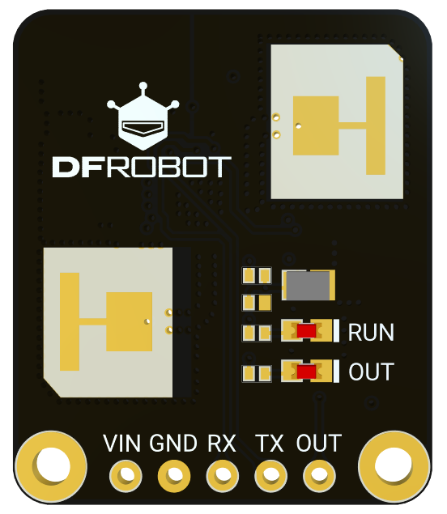

# ESP32C3-PRO
ESP32-C3 PRO开发板采用32位RISC-V单核主控，集成2.4G WiFi与蓝牙5.0双模通信，兼顾低功耗运行与稳定运算性能。板载OLED显示屏，可便捷实现数据显示、人机交互等功能。

# C4002毫米波雷达模块

C4002是一款基于24GHz FMCW技术的毫米波雷达模块，专为智能家居场景中需要精准静态人体存在感知的应用而设计。模块突破了传统PIR传感器只能检测大幅运动的局限，可在10x10m的有效检测范围内，同步侦测运动人体与静止（微动）人体，并支持运动速度检测、运动方向识别（靠近/远离）及环境光检测功能。

- 工作电压：3.6~5.5V
- 检测能力：运动、微动/静止人体
- 最大检测距离：运动11m、微动/静止10m
- 探测角度：120°x120°
- 输出接口：OUT（可配置IO），UART
- 工作频率：24GHz~24.25GHz
- 光线检测：0~50lux
- 工作温度：-20~85℃
- 产品尺寸：22mm x 26mm

